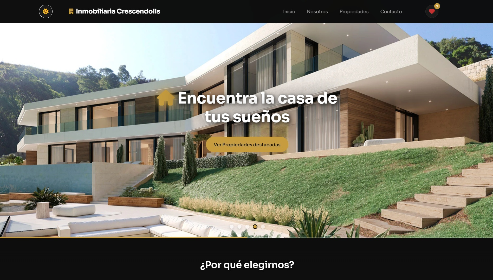
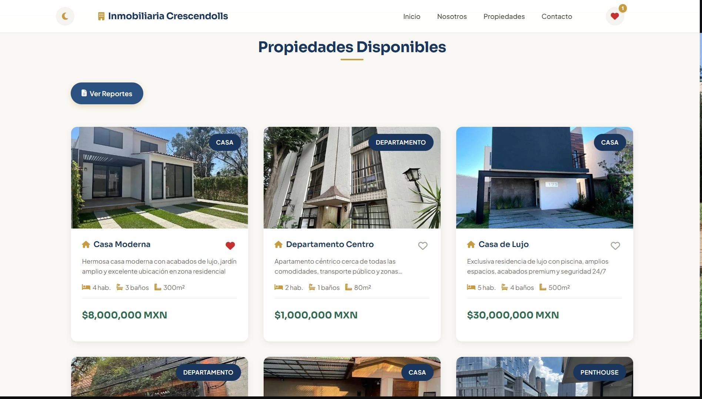
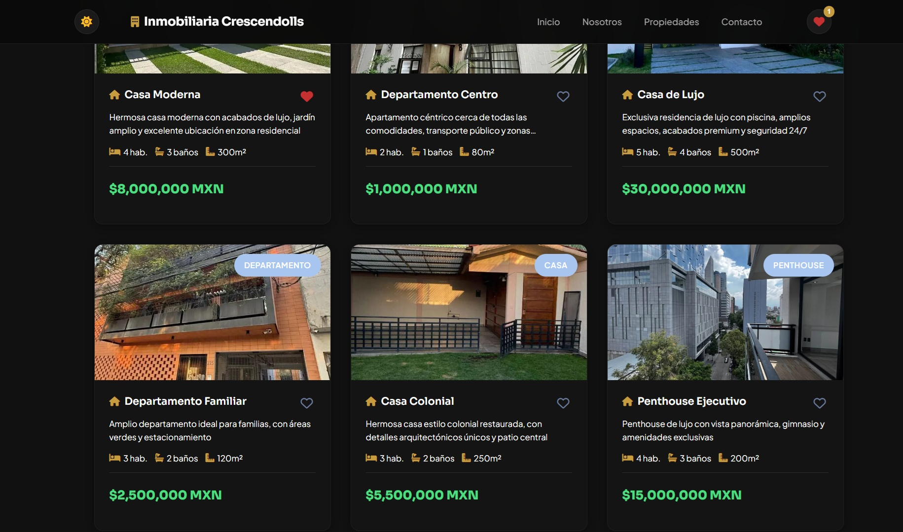
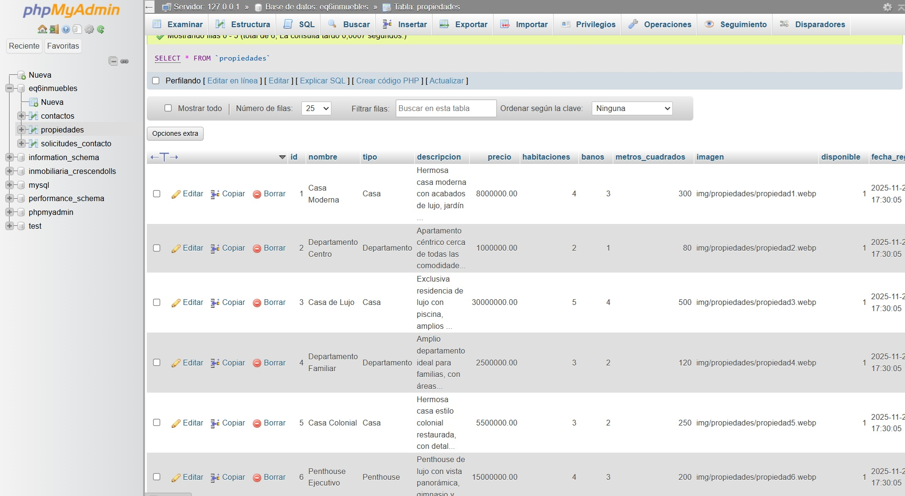

# 🏠 Inmobiliaria Crescendolls

Sitio web inmobiliario moderno con sistema de propiedades, favoritos y modo oscuro.


## 📋 Descripción

Inmobiliaria Crescendolls es una aplicación web completa para la gestión y visualización de propiedades inmobiliarias. Incluye un diseño moderno, responsivo y con soporte para modo oscuro.

## ✨ Características

- 🏡 **Catálogo de Propiedades** - Visualización de propiedades con carrusel de imágenes
- ❤️ **Sistema de Favoritos** - Guarda tus propiedades favoritas (localStorage)
- 🌙 **Modo Oscuro** - Tema claro/oscuro persistente
- 📱 **Diseño Responsivo** - Adaptable a todos los dispositivos
- 📧 **Formulario de Contacto** - Solicitudes de información y contacto general
- 📊 **Panel de Reportes** - Gestión de solicitudes y mensajes

## 🚀 Instalación

> **Nota:** Este proyecto utiliza Docker para facilitar el despliegue y desarrollo. No se requiere XAMPP ni phpMyAdmin.

### Requisitos
- Docker y Docker Compose instalados
- Navegador web moderno

### Pasos

1. **Clona el repositorio**
   ```bash
   git clone https://github.com/diegoesr/Inmobiliaria-Crescendolls.git
   cd Inmobiliaria-Crescendolls
   ```

2. **Configura las variables de entorno (opcional)**
   ```bash
   cd docker
   cp env.example.txt .env
   ```
   Edita `.env` si necesitas cambiar las credenciales por defecto.

3. **Inicia los contenedores Docker**
   ```bash
   docker-compose up -d
   ```

4. **Accede a la aplicación**
   - **Aplicación web**: http://localhost:8080
   - **Adminer (gestión de BD)**: http://localhost:8081
     - Servidor: `db`
     - Usuario: `inmobiliaria_user`
     - Contraseña: `inmobiliaria_pass`
     - Base de datos: `eq6inmobiliaria`

### Comandos Docker Útiles

```bash
# Iniciar contenedores
docker-compose up -d

# Detener contenedores
docker-compose down

# Ver logs
docker-compose logs -f

# Reiniciar servicios
docker-compose restart

# Detener y eliminar volúmenes (¡cuidado! elimina la BD)
docker-compose down -v
```

## 📁 Estructura del Proyecto

```
inmobiliaria-crescendolls/
├── index.html              # Página principal
├── nosotros.html           # Página "Sobre Nosotros"
├── README.md               # Este archivo
├── .gitignore              # Archivos ignorados por Git
│
├── css/
│   └── style.css           # Estilos principales
│
├── js/
│   ├── app.js              # Funcionalidad común
│   ├── carousel.js         # Carrusel de imágenes
│   ├── dark-mode.js        # Toggle de tema
│   ├── favorites.js        # Sistema de favoritos
│   └── utils.js            # Utilidades (toast, AOS)
│
├── img/                    # Imágenes del sitio
│
├── php/
│   ├── config.php          # Configuración de BD
│   ├── api.php             # API REST para propiedades
│   ├── contacto.php        # Página de contacto
│   ├── propiedades.php     # Listado de propiedades
│   ├── reportes.php        # Panel de reportes
│   └── procesar_*.php      # Procesadores de formularios
│
├── database/
│   ├── inmobiliaria.sql    # Script de base de datos
│   └── actualizar_imagenes_propiedades.sql  # Actualización de rutas de imágenes
│
└── docker/
    ├── docker-compose.yml  # Configuración de servicios Docker
    └── env.example.txt     # Ejemplo de variables de entorno
```

## 🛠️ Tecnologías

| Tecnología | Uso |
|------------|-----|
| Docker | Contenedorización y despliegue |
| Docker Compose | Orquestación de servicios |
| HTML5 | Estructura |
| CSS3 | Estilos y animaciones |
| JavaScript (ES6+) | Interactividad y Fetch API |
| PHP | Backend y conexión BD |
| MySQL | Base de datos relacional |
| Adminer | Administración de base de datos |
| AOS.js | Animaciones scroll |
| Font Awesome | Iconos |

## 🔌 API Endpoints

El proyecto incluye una API REST para acceder a los datos de las propiedades:

### Base URL
```
http://localhost:8080/php/api.php
```

### Endpoints Disponibles

#### Obtener todas las propiedades
```http
GET /php/api.php?action=propiedades
```
**Respuesta:**
```json
{
  "success": true,
  "data": [...],
  "count": 10
}
```

#### Obtener una propiedad específica
```http
GET /php/api.php?action=propiedad&id=1
```
**Respuesta:**
```json
{
  "success": true,
  "data": {...}
}
```

#### Obtener propiedades destacadas
```http
GET /php/api.php?action=propiedades-destacadas&limit=3
```
**Parámetros:**
- `limit` (opcional): Número de propiedades a obtener (por defecto: 3, máximo: 20)

**Respuesta:**
```json
{
  "success": true,
  "data": [...],
  "count": 3
}
```

## 📸 Capturas de Pantalla

### Página Principal

#### Modo Claro

*Vista de la página principal con el carrusel de propiedades destacadas en modo claro*

#### Modo Oscuro

*Vista de la página principal con el carrusel de propiedades destacadas en modo oscuro*

### Catálogo de Propiedades

#### Modo Claro

*Listado completo de propiedades disponibles en modo claro*

#### Modo Oscuro

*Listado completo de propiedades disponibles en modo oscuro*

### Base de Datos en Adminer

*Gestión de la base de datos mediante Adminer en Docker*


---

### Características Visuales Destacadas

- 🎨 **Diseño Moderno**: Interfaz limpia y profesional
- 🌓 **Modo Oscuro/Claro**: Tema adaptable según preferencias del usuario
- 📱 **Totalmente Responsive**: Optimizado para todos los dispositivos
- 🖼️ **Carrusel Dinámico**: Imágenes destacadas con transiciones suaves
- 🏠 **Grid de Propiedades**: Visualización organizada en formato de tarjetas

## 👥 Equipo

Desarrollado por **Diego Esparza Rodríguez** - [@diegoesr](https://github.com/diegoesr)

---

⭐ Si te gusta este proyecto, ¡dale una estrella!

